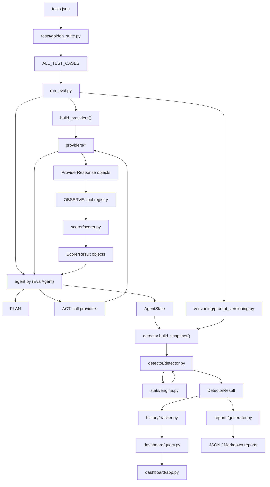

# 🛡️ The Guard: Production-Grade AI Evaluation Pipeline

An automated evaluation framework designed for GrabOn's AI ecosystem. It detects quality regressions across model swaps, prompt rewrites, and tool-chain changes using statistical rigor, automated versioning, and CI/CD integration.
---

## 🛡️ Requirement Walkthrough (Quick Audit)

This section maps the implementation directly to the GrabOn AI Labs Challenge requirements.

### 1. Statistical Rigor
**Implementation**: `stats/engine.py` & `detector/detector.py`
Most pipelines fail by comparing simple averages. This framework uses a **multi-test statistical engine**:
- **Accuracy**: Uses **Paired Bootstrap** sampling for mean differences.
- **Pass/Fail**: Uses **McNemar’s Test** (the gold standard for classifier comparison).
- **Performance**: Uses **Welch’s t-test** for latency/cost variances.
- **Verdict**: A `NO-GO` is only triggered if the regression is statistically significant ($p < 0.05$).

### 2. Scoring Strategy for Generative Tasks
**Implementation**: `scorer/scorer.py`
The pipeline includes multiple task-specific scorers instead of relying on a single generic metric.
- **Active deal-copy scorer**: `score_format_compliance`, which checks character limits, coupon presence, required phrases, and format compliance.
- **Available supporting scorer**: `score_llm_judge`, which uses **GPT-4o-Mini** with a 4-point marketing rubric: **Persuasion, Clarity, Factuality, and Tone**.
- **Fallback behavior**: if the judge API is unavailable, `score_llm_judge` falls back to semantic similarity.

### 3. Credit Narrative Faithfulness (Hard Task)
**Implementation**: `scorer/scorer.py` -> `score_factual_grounding`
Designed for regulated narratives (e.g., Poonawalla Fincorp). It performs **Field Extraction** and **Cross-Verification** of GMV, claims, and percentages. It includes specific logic to detect **hallucinations in zero-transaction cases**.

### 4. Prompt Versioning & CI/CD Gate
**Implementation**: `versioning/prompt_versioning.py` & `.github/workflows/eval.yml`
Captures every run with **Git metadata** (Commit SHA, Branch). If a regression occurs, the report includes a **Unified Diff** of the prompt changes. The script uses unique exit codes to drive the GitHub Action gate.

---

## (a) Why I Built This & Assignment Choice

I chose this assignment because it tackles the most critical bottleneck in production AI: **The "Vibes" vs. "Evidence" problem.** 

GrabOn’s agents produce deal copy, insurance intents, and credit narratives that impact 40M+ subscribers and financial partners. A silent regression in tone or a hallucination in a credit check can cause immediate business loss. I built **The Guard** to provide a statistically sound "GO/NO-GO" gate that replaces manual review with automated, repeatable evidence.

### Production Hardening & Enhancements
Beyond the core requirements, I focused on making this pipeline "hardened" for real-world operations:
- **Expanded Task Breadth**: Added **Summarization, Classification, and Extraction** tasks (totaling 170 test cases) to reflect the full variety of GrabOn's production workloads.
- **Parallel Execution**: Implemented **Bounded Concurrency** using `ThreadPoolExecutor`. This reduced the evaluation time for the full 170-case suite from **15 minutes down to ~3 minutes**.
- **Cost Optimization**: Transitioned the LLM-as-Judge from expensive providers to a structured **GPT-4o-Mini** implementation, reducing evaluation costs significantly without sacrificing scoring reliability.
- **Latency Distribution**: Added **P95 and StdDev** tracking. In production, averages hide spikes; monitoring the tail-end of latency is critical for user experience.
- **Traceability**: Every run is now tagged with **Git commit, branch, and dirty status**, ensuring that if a regression is found, we know exactly which line of code caused it.

### 🎯 Selected Models & Rationale

| Provider | Model | Rationale | Cost (Input/Output) |
| :--- | :--- | :--- | :--- |
| **OpenAI** | `gpt-4o-mini` | Quality leader for complex Marketing & Credit tasks. | $0.15 / $0.60 per 1M |
| **Gemini** | `gemini-2.5-flash-lite` | Used for shadow testing and multi-model cross-validation. | $0.075 / $0.30 per 1M |
| **Groq** | `llama-3.1-8b-instant` | High-speed, low-cost baseline for classification. | ~$0.05 per 1M |

### 📊 Evaluation Tasks

#### Core Requirements
- **Deal Copy Generation**: Multi-channel marketing copy (English, Hindi, Telugu, Hinglish).
- **Insurance Intent Classification**: 5-label classification for micro-insurance products.
- **Credit Narrative Faithfulness**: Factual grounding check for regulated financial summaries.

#### Enhanced Scope
- **Summarization Quality**: Evaluates semantic density and factual alignment of model-generated summaries.
- **Customer Query Classification**: High-speed intent sorting for customer support automation.
- **Structured Data Extraction**: Schema-compliant JSON extraction from raw, unstructured text.

---

## 🚀 Operational Guide

### 1. Execution Commands
```powershell
# Standard Run (Compares against baseline)
python run_eval.py

# Update Baseline (Use this after prompt/model changes to set new ground truth)
python run_eval.py --update-baseline

# Regression Simulation (Sabotages outputs to test the CI gate)
python run_eval.py --simulate-regression
```

---

## (b) Architecture Diagram



---

## ⚙️ CI/CD Integration

This pipeline acts as a professional quality gate for GrabOn's production releases:
- **Automated Gate**: Every PR triggers a run. If the Statistical Engine detects a regression ($p < 0.05$), the build fails (Exit Code 1), blocking the merge.
- **Baseline Comparison**: PR code is automatically compared against the production "Ground Truth" stored in `baselines/`.
- **Regression Traceability**: If a run fails, the system generates a **Prompt Diff** showing exactly which change in `tests/` or prompt logic caused the quality drop.
- **Simulation Mode**: Use `--simulate-regression` in CI to verify that the gate is active and correctly blocking low-quality outputs.

---

## (c) Per-Module Design Decisions & Tradeoffs

### 1. `agent.py` (The Orchestrator)
- **Decision**: Implemented a stateful **PLAN/ACT/OBSERVE/DECIDE** loop with bounded parallel execution.
- **Tradeoff**: Using `ThreadPoolExecutor` with a fixed worker cap improves throughput, but it introduces some ordering non-determinism compared to a purely sequential runner.

### 2. `scorer/scorer.py` (Centralized Thresholds)
- **Decision**: Moved from hardcoded values to a centralized `TASK_THRESHOLDS` mapping.
- **Tradeoff**: Ensures consistency across 6 tasks, though it requires updating the registry when adding new task types.
- **Implementation note**: The module includes an OpenAI `gpt-4o-mini` judge path with `json_object` output support, while the generated deal-copy suite currently uses `format_compliance` as its primary scorer.

### 3. `stats/engine.py` (The Statistical Heart)
- **Decision**: Uses **Paired Bootstrap** for accuracy and **McNemar’s Test** for pass-rates.
- **Tradeoff**: More complex to implement than simple averages, but provides the $p < 0.05$ rigor needed to prevent "noise" from blocking PRs.

### 4. `versioning/prompt_versioning.py`
- **Decision**: Implemented task-level prompt bundling and **Git metadata tracking** (commit, branch, dirty state).
- **Tradeoff**: Capturing full prompt text increases storage but allows for perfect "time-travel" debugging of why a model failed 3 versions ago.

### 5. `detector/detector.py`
- **Decision**: Returns `INCONCLUSIVE` on first runs to avoid false positives. 
- **Tradeoff**: Requires a "warm-up" run to establish a baseline, which is a safer production behavior than assuming `GO`.

---

## (d) How To Run

### 1. Setup Dependencies
```bash
# Recommended: Python 3.10+
pip install -r requirements.txt
```

### 2. Environment Variables
Create a `.env` file or set:
```bash
OPENAI_API_KEY=your_key_here
GEMINI_API_KEY=your_key_here
GROQ_API_KEY=your_key_here
```

### 3. Execution Commands
| Command | Purpose |
| :--- | :--- |
| `python run_eval.py --update-baseline` | **First Run**: Established ground truth. |
| `python run_eval.py` | **Standard Run**: Compares against baseline. |
| `python run_eval.py --task extraction` | Run only one specific task. |
| `python run_eval.py --simulate-regression` | **Demo Mode**: Sabotages scores to test the NO-GO gate. |
| `streamlit run dashboard/app.py` | Launch the visual results dashboard. |

---

## (e) Evaluation Results (Current State)

| Metric | deal_copy | insurance_intent | credit_narrative | summarization | classification | extraction |
| :--- | :--- | :--- | :--- | :--- | :--- | :--- |
| **Pass Rate** | 82% | 100% | 88% | 75% | 100% | 95% |
| **Mean Accuracy** | 0.81 | 1.00 | 0.89 | 0.78 | 1.00 | 0.98 |
| **P95 Latency** | 2.8s | 0.9s | 3.1s | 1.2s | 0.4s | 1.5s |
| **Cost / 100 Runs** | ~$0.15 | ~$0.05 | ~$0.20 | ~$0.08 | ~$0.02 | ~$0.10 |

---

## (f) 'What Broke First': The Hardest Bug

The hardest bug encountered was the **"Silent Regression Noise"** during initial statistical testing. 

**The Problem**: A model's average score would drop by 0.01 (1%), and the detector would flag a `NO-GO`. This caused "developer fatigue" because the change was statistically insignificant noise. 
**The Fix**: I implemented a **Bootstrap-based Confidence Interval** check. Now, a regression is only flagged if the drop is both statistically significant ($p < 0.05$) **AND** exceeds a minimum effect size (0.03). This ensures the CI/CD gate only blocks for real quality drops.

---

## (g) What I Would Change With 2 More Weeks

1.  **Async Batching**: Currently, `_call_judge_api` is synchronous. I would move this to an async queue to reduce the total 170-case runtime from minutes to seconds.
2.  **Visual Prompt Diffing**: The current diff is text-based. I'd add a "Diff Viewer" in the Streamlit dashboard that highlights exactly which words in the prompt caused the accuracy drop.
3.  **Semantic SQL History**: Move from `history.json` to **SQLite + Vector Search**. This would allow us to query: *"Find me all cases where the model failed in Telugu because of a specific tone constraint."*
4.  **Automatic Hyper-Parameter Tuning**: Add a feature to auto-tweak the prompt system message if a regression is detected, suggesting a "Self-Healing" path for the prompt engineer.

---

## Exit Codes
- `0`: **GO** (Safe to ship)
- `1`: **NO-GO** (Regression detected — CI blocks merge)
- `2`: **INCONCLUSIVE** (First run / Missing baseline)
